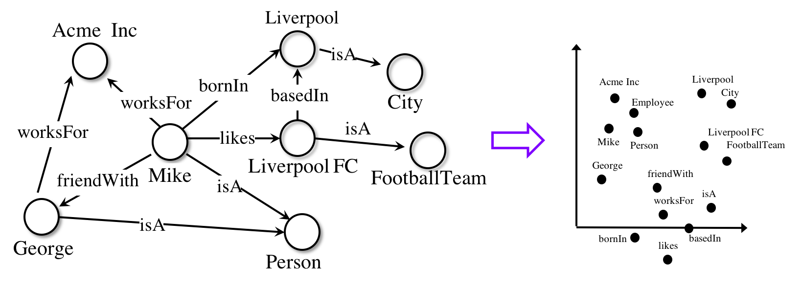
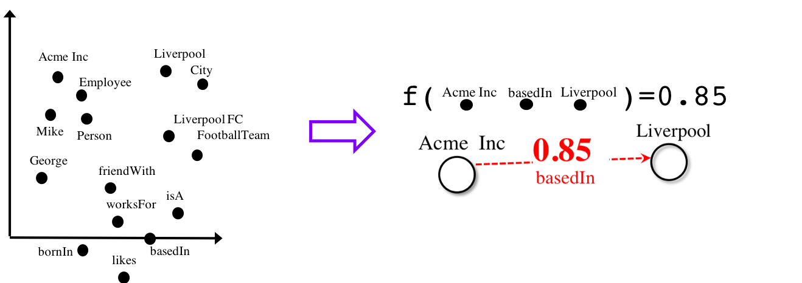

# 

[](https://doi.org/10.5281/zenodo.2595043)

[](http://ampligraph.readthedocs.io/?badge=latest)

[Join the conversation on Slack](https://join.slack.com/t/ampligraph/shared_invite/enQtNTc2NTI0MzUxMTM5LTRkODk0MjI2OWRlZjdjYmExY2Q3M2M3NGY0MGYyMmI4NWYyMWVhYTRjZDhkZjA1YTEyMzBkMGE4N2RmNTRiZDg)


**Open source library based on TensorFlow that predicts links between concepts in a knowledge graph.**

**AmpliGraph** is a suite of neural machine learning models for relational Learning, a branch of machine learning
that deals with supervised learning on knowledge graphs.


**Use AmpliGraph if you need to**:

* Discover new knowledge from an existing knowledge graph.
* Complete large knowledge graphs with missing statements.
* Generate stand-alone knowledge graph embeddings.
* Develop and evaluate a new relational model.


AmpliGraph's machine learning models generate **knowledge graph embeddings**, vector representations of concepts in a metric space:



It then combines embeddings with model-specific scoring functions to predict unseen and novel links:




## Key Features


* **Intuitive APIs**: AmpliGraph APIs are designed to reduce the code amount required to learn models that predict links in knowledge graphs.
* **GPU-Ready**: AmpliGraph is based on TensorFlow, and it is designed to run seamlessly on CPU and GPU devices - to speed-up training.
* **Extensible**: Roll your own knowledge graph embeddings model by extending AmpliGraph base estimators.


## Modules

AmpliGraph includes the following submodules:

* **Datasets**: helper functions to load datasets (knowledge graphs).
* **Models**: knowledge graph embedding models. AmpliGraph contains **TransE**, **DistMult**, **ComplEx**, **HolE**, **ConvE**, **ConvKB**. (More to come!)
* **Evaluation**: metrics and evaluation protocols to assess the predictive power of the models.
* **Discovery**: High-level convenience APIs for knowledge discovery (discover new facts, cluster entities, predict near duplicates).


## Installation

### Prerequisites

* Linux, macOS, Windows
* Python 3.7

#### Provision a Virtual Environment

Create and activate a virtual environment (conda)

```
conda create --name ampligraph python=3.7
source activate ampligraph
```

#### Install TensorFlow

AmpliGraph is built on TensorFlow 1.x.
Install from pip or conda:

**CPU-only**

```
pip install "tensorflow>=1.15.2,<2.0"

or

conda install tensorflow'>=1.15.2,<2.0.0'
```

**GPU support**

```
pip install "tensorflow-gpu>=1.15.2,<2.0"

or

conda install tensorflow-gpu'>=1.15.2,<2.0.0'
```


### Install AmpliGraph


Install the latest stable release from pip:

```
pip install ampligraph
```

If instead you want the most recent development version, you can clone the repository
and install from source (your local working copy will be on the latest commit on the `develop` branch).
The code snippet below will install the library in editable mode (`-e`):

```
git clone https://github.com/Accenture/AmpliGraph.git
cd AmpliGraph
pip install -e .
```


### Sanity Check

```python
>> import ampligraph
>> ampligraph.__version__
'1.4.0'
```


## Predictive Power Evaluation (MRR Filtered)

AmpliGraph includes implementations of TransE, DistMult, ComplEx, HolE, ConvE, and ConvKB.
Their predictive power is reported below and compared against the state-of-the-art results in literature.
[More details available here](https://docs.ampligraph.org/en/latest/experiments.html).

|                              |FB15K-237 |WN18RR   |YAGO3-10   | FB15k      |WN18           |
|------------------------------|----------|---------|-----------|------------|---------------|
| Literature Best              | **0.35***| 0.48*   | 0.49*     | **0.84**** | **0.95***     |
| TransE (AmpliGraph)          |  0.31    | 0.22    | **0.51**  | 0.63       | 0.66          |
| DistMult (AmpliGraph)        |  0.31    | 0.47    | 0.50      | 0.78       | 0.82          |
| ComplEx  (AmpliGraph)        |  0.32    | **0.51**| 0.49      | 0.80       | 0.94          |
| HolE (AmpliGraph)            |  0.31    | 0.47    | 0.50      | 0.80       | 0.94          |
| ConvE (AmpliGraph)           |  0.26    | 0.45    | 0.30      | 0.50       | 0.93          |
| ConvE (1-N, AmpliGraph)      |  0.32    | 0.48    | 0.40      | 0.80       | **0.95**      |
| ConvKB (AmpliGraph)          |  0.23    | 0.39    | 0.30      | 0.65       | 0.80          |

<sub>
* Timothee Lacroix, Nicolas Usunier, and Guillaume Obozinski. Canonical tensor decomposition for knowledge base 
completion. In International Conference on Machine Learning, 2869–2878. 2018. <br/>
**  Kadlec, Rudolf, Ondrej Bajgar, and Jan Kleindienst. "Knowledge base completion: Baselines strike back.
 " arXiv preprint arXiv:1705.10744 (2017).
</sub>

<sub>
Results above are computed assigning the worst rank to a positive in case of ties. 
Although this is the most conservative approach, some published literature may adopt an evaluation protocol that assigns
 the best rank instead. 
</sub>


## Documentation

**[Documentation available here](http://docs.ampligraph.org)**

The project documentation can be built from your local working copy with:

```
cd docs
make clean autogen html
```

## How to contribute

See [guidelines](http://docs.ampligraph.org) from AmpliGraph documentation.


## How to Cite

If you like AmpliGraph and you use it in your project, why not starring the project on GitHub!

[](https://GitHub.com/Accenture/AmpliGraph/stargazers/)


If you instead use AmpliGraph in an academic publication, cite as:

```
@misc{ampligraph,
 author= {Luca Costabello and
          Sumit Pai and
          Chan Le Van and
          Rory McGrath and
          Nicholas McCarthy and
          Pedro Tabacof},
 title = {{AmpliGraph: a Library for Representation Learning on Knowledge Graphs}},
 month = mar,
 year  = 2019,
 doi   = {10.5281/zenodo.2595043},
 url   = {https://doi.org/10.5281/zenodo.2595043}
}
```

## License

AmpliGraph is licensed under the Apache 2.0 License.