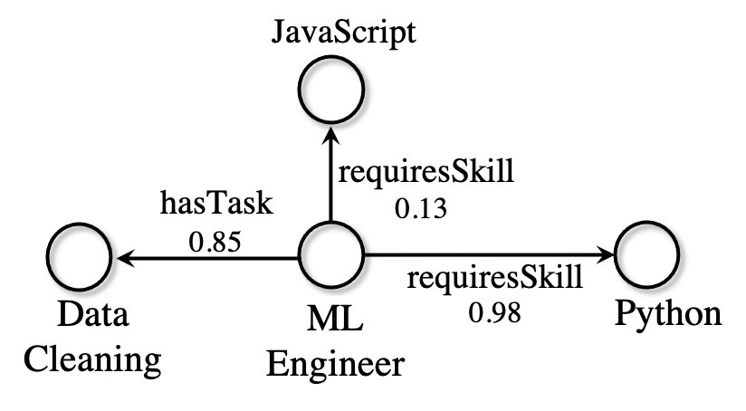

Datasets
========
.. currentmodule:: ampligraph.datasets

.. automodule:: ampligraph.datasets

.. note::
    It is recommended to set the ``AMPLIGRAPH_DATA_HOME`` environment variable::

        export AMPLIGRAPH_DATA_HOME=/YOUR/PATH/TO/datasets

    When attempting to load a dataset, the module will first check if ``AMPLIGRAPH_DATA_HOME`` is set.
    If it is, it will search this location for the required dataset.
    If the dataset is not found it will be downloaded and placed in this directory.

    If ``AMPLIGRAPH_DATA_HOME`` has not been set the databases will be saved in the following directory::

        ~/ampligraph_datasets

Benchmark Datasets Loaders
^^^^^^^^^^^^^^^^^^^^^^^^^^

Use these helper functions to load datasets used in graph representation learning literature.
The functions will **automatically download** the datasets if they are not present in ``~/ampligraph_datasets`` or
at the location set in ``AMPLIGRAPH_DATA_HOME``.

.. role:: red

.. autosummary::
    :toctree: generated
    :template: function.rst

    load_fb15k_237
    load_wn18rr
    load_yago3_10
    load_fb15k
    load_wn18
    load_wn11
    load_fb13

**Datasets Summary**

========= ========= ======= ======= ============ ===========
 Dataset  Train     Valid   Test    Entities     Relations
========= ========= ======= ======= ============ ===========
FB15K-237 272,115   17,535  20,466  14,541        237
WN18RR    86,835    3,034   3,134   40,943        11
FB15K     483,142   50,000  59,071  14,951        1,345
WN18      141,442   5,000   5,000   40,943        18
YAGO3-10  1,079,040 5,000   5,000   123,182       37
WN11      110,361   5,215   21,035  38,194        11
FB13      316,232   11,816  47,464  75,043        13
========= ========= ======= ======= ============ ===========

.. warning::
    WN18 and FB15k include a large number of inverse relations, and its use in experiments has been deprecated.
    **Use WN18RR and FB15K-237 instead**.

.. warning:: FB15K-237's validation set contains 8 unseen entities over 9 triples. The test set has 29 unseen entities,
        distributed over 28 triples. WN18RR's validation set contains 198 unseen entities over 210 triples. The test set
        has 209 unseen entities, distributed over 210 triples.

.. note::
    WN11 and FB13 also provide true and negative labels for the triples in the validation and tests sets.
    In both cases the positive base rate is close to 50%.

Benchmark Datasets Loaders (Knowledge Graphs With Numeric Values on Edges)
^^^^^^^^^^^^^^^^^^^^^^^^^^^^^^^^^^^^^^^^^^^^^^^^^^^^^^^^^^^^^^^^^^^^^^^^^^
.. _numeric-enriched-edges-loaders:
These helper functions load benchmark datasets **with numeric values on edges**,
as described in :cite:`pai2021learning` (the figure below shows a toy example).

.. hint::
    To process a knowledge graphs with numeric values associated to edges, enable the
    :ref:`FocusE layer <edge-literals>`
    when training a knowledge graph embedding model :cite:`pai2021learning`.

The functions will **automatically download** the datasets if they are not present in ``~/ampligraph_datasets`` or
at the location set in ``AMPLIGRAPH_DATA_HOME``.

.. autosummary::
    :toctree: generated
    :template: function.rst

    load_onet20k
    load_ppi5k
    load_nl27k
    load_cn15k

**Datasets Summary (KGs with numeric values on edges)**

========= ========= ======= ========= =========== =========
 Dataset  Train     Valid   Test      Entities    Relations
========= ========= ======= ========= =========== =========
O*NET20K  461,932   138      2,000    20,643      19
PPI5K     230,929   19,017   21,720   4,999       7
NL27K     149,100   12,274   14,026   27,221      405
CN15K     199,417   16,829   19,224   15,000      36
========= ========= ======= ========= =========== =========

Loaders for Custom Knowledge Graphs
^^^^^^^^^^^^^^^^^^^^^^^^^^^^^^^^^^^

Functions to load custom knowledge graphs from disk.

.. autosummary::
    :toctree: generated
    :template: function.rst

    load_from_csv
    load_from_ntriples
    load_from_rdf

.. hint::
    AmpliGraph includes a helper function to split a generic knowledge graphs into **training**,
    **validation**, and **test** sets. See :meth:`ampligraph.evaluation.train_test_split_no_unseen`.
