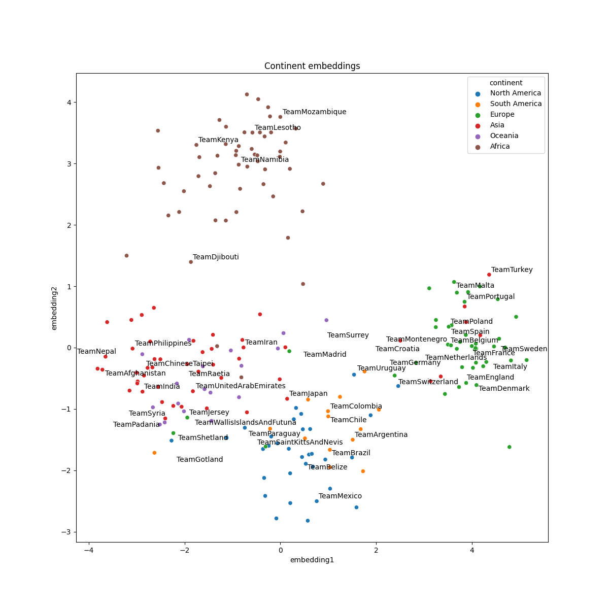
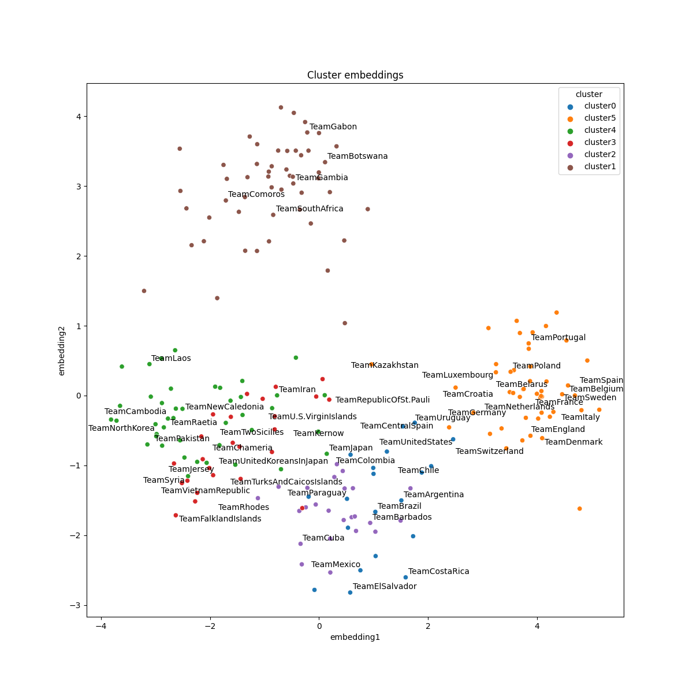

# Examples

These examples show how to get started with AmpliGraph APIs, and cover a range of useful tasks. 
Note that additional tutorials are also [available](tutorials.md).


## Train and evaluate an embedding model

```python
import numpy as np
from ampligraph.datasets import load_wn18
from ampligraph.latent_features import ComplEx
from ampligraph.evaluation import evaluate_performance, mrr_score, hits_at_n_score

def main():

    # load Wordnet18 dataset:
    X = load_wn18()

    # Initialize a ComplEx neural embedding model with pairwise loss function:
    # The model will be trained for 300 epochs.
    model = ComplEx(batches_count=10, seed=0, epochs=20, k=150, eta=10,
                    # Use adam optimizer with learning rate 1e-3
                    optimizer='adam', optimizer_params={'lr':1e-3},
                    # Use pairwise loss with margin 0.5
                    loss='pairwise', loss_params={'margin':0.5},
                    # Use L2 regularizer with regularizer weight 1e-5
                    regularizer='LP', regularizer_params={'p':2, 'lambda':1e-5}, 
                    # Enable stdout messages (set to false if you don't want to display)
                    verbose=True)

    # For evaluation, we can use a filter which would be used to filter out 
    # positives statements created by the corruption procedure.
    # Here we define the filter set by concatenating all the positives
    filter = np.concatenate((X['train'], X['valid'], X['test']))
    
    # Fit the model on training and validation set
    model.fit(X['train'], 
              early_stopping = True,
              early_stopping_params = \
                      {
                          'x_valid': X['valid'],       # validation set
                          'criteria':'hits10',         # Uses hits10 criteria for early stopping
                          'burn_in': 100,              # early stopping kicks in after 100 epochs
                          'check_interval':20,         # validates every 20th epoch
                          'stop_interval':5,           # stops if 5 successive validation checks are bad.
                          'x_filter': filter,          # Use filter for filtering out positives 
                          'corruption_entities':'all', # corrupt using all entities
                          'corrupt_side':'s+o'         # corrupt subject and object (but not at once)
                      }
              )

    

    # Run the evaluation procedure on the test set (with filtering). 
    # To disable filtering: filter_triples=None
    # Usually, we corrupt subject and object sides separately and compute ranks
    ranks = evaluate_performance(X['test'], 
                                 model=model, 
                                 filter_triples=filter,
                                 use_default_protocol=True, # corrupt subj and obj separately while evaluating
                                 verbose=True)

    # compute and print metrics:
    mrr = mrr_score(ranks)
    hits_10 = hits_at_n_score(ranks, n=10)
    print("MRR: %f, Hits@10: %f" % (mrr, hits_10))
    # Output: MRR: 0.886406, Hits@10: 0.935000

if __name__ == "__main__":
    main()
```


## Model selection


```python
from ampligraph.datasets import load_wn18
from ampligraph.latent_features import ComplEx
from ampligraph.evaluation import select_best_model_ranking

def main():

    # load Wordnet18 dataset:
    X_dict = load_wn18()

    model_class = ComplEx

    # Use the template given below for doing grid search. 
    param_grid = {
                     "batches_count": [10],
                     "seed": 0,
                     "epochs": [4000],
                     "k": [100, 50],
                     "eta": [5,10],
                     "loss": ["pairwise", "nll", "self_adversarial"],
                     # We take care of mapping the params to corresponding classes
                     "loss_params": {
                         #margin corresponding to both pairwise and adverserial loss
                         "margin": [0.5, 20], 
                         #alpha corresponding to adverserial loss
                         "alpha": [0.5]
                     },
                     "embedding_model_params": {
                         # generate corruption using all entities during training
                         "negative_corruption_entities":"all"
                     },
                     "regularizer": [None, "LP"],
                     "regularizer_params": {
                         "p": [2],
                         "lambda": [1e-4, 1e-5]
                     },
                     "optimizer": ["adam"],
                     "optimizer_params":{
                         "lr": [0.01, 0.0001]
                     },
                     "verbose": True
                 }

    # Train the model on all possibile combinations of hyperparameters.
    # Models are validated on the validation set.
    # It returnes a model re-trained on training and validation sets.
    best_model, best_params, best_mrr_train, \
    ranks_test, mrr_test = select_best_model_ranking(model_class, # Class handle of the model to be used
                                                     # Dataset 
                                                     X_dict['train'],
                                                     X_dict['valid'],
                                                     X_dict['test'],          
                                                     # Parameter grid
                                                     param_grid,      
                                                     # Use filtered set for eval
                                                     use_filter=True, 
                                                     # corrupt subject and objects separately during eval
                                                     use_default_protocol=True, 
                                                     # Log all the model hyperparams and evaluation stats
                                                     verbose=True)
    print(type(best_model).__name__, best_params, best_mrr_train, mrr_test)

if __name__ == "__main__":
    main()
```

## Get the embeddings

```python
import numpy as np
from ampligraph.latent_features import ComplEx

model = ComplEx(batches_count=1, seed=555, epochs=20, k=10)
X = np.array([['a', 'y', 'b'],
              ['b', 'y', 'a'],
              ['a', 'y', 'c'],
              ['c', 'y', 'a'],
              ['a', 'y', 'd'],
              ['c', 'y', 'd'],
              ['b', 'y', 'c'],
              ['f', 'y', 'e']])
model.fit(X)
model.get_embeddings(['f','e'], embedding_type='entity')
```

## Save and restore a model
```python
import numpy as np
from ampligraph.latent_features import ComplEx
from ampligraph.utils import save_model, restore_model

model = ComplEx(batches_count=2, seed=555, epochs=20, k=10)

X = np.array([['a', 'y', 'b'],
            ['b', 'y', 'a'],
            ['a', 'y', 'c'],
            ['c', 'y', 'a'],
            ['a', 'y', 'd'],
            ['c', 'y', 'd'],
            ['b', 'y', 'c'],
            ['f', 'y', 'e']])

model.fit(X)

#  Use the trained model to predict 
y_pred_before = model.predict(np.array([['f', 'y', 'e'], ['b', 'y', 'd']]))
print(y_pred_before)
#[-0.29721245, 0.07865551]

# Save the model
example_name = "helloworld.pkl"
save_model(model, model_name_path = example_name)

# Restore the model
restored_model = restore_model(model_name_path = example_name)

# Use the restored model to predict
y_pred_after = restored_model.predict(np.array([['f', 'y', 'e'], ['b', 'y', 'd']]))
print(y_pred_after)
# [-0.29721245, 0.07865551]
```

## Split dataset into train/test or train/valid/test 
```python
import numpy as np
from ampligraph.evaluation import train_test_split_no_unseen
from ampligraph.datasets import load_from_csv

'''
Assume we have a knowledge graph stored in my_folder/my_graph.csv,
and that the content of such file is:

a,y,b
f,y,e
b,y,a
a,y,c
c,y,a
a,y,d
c,y,d
b,y,c
f,y,e
'''

# Load the graph in memory
X = load_from_csv('my_folder', 'my_graph.csv', sep=',')

# To split the graph in train and test sets:
# (In this toy example the test set will include only two triples)
X_train, X_test = train_test_split_no_unseen(X, test_size=2)

print(X_train)

'''
X_train:[['a' 'y' 'b']
         ['f' 'y' 'e']
         ['b' 'y' 'a']
         ['c' 'y' 'a']
         ['c' 'y' 'd']
         ['b' 'y' 'c']
         ['f' 'y' 'e']]
'''

print(X_test)

'''
X_test: [['a' 'y' 'c']
         ['a' 'y' 'd']]
'''


# To split the graph in train, validation, and test the method must be called twice:
X_train_valid, X_test = train_test_split_no_unseen(X, test_size=2)
X_train, X_valid = train_test_split_no_unseen(X_train_valid, test_size=2)

print(X_train)
'''
X_train:  [['a' 'y' 'b']
           ['b' 'y' 'a']
           ['c' 'y' 'd']
           ['b' 'y' 'c']
           ['f' 'y' 'e']]
'''

print(X_valid)
'''
X_valid:  [['f' 'y' 'e']
           ['c' 'y' 'a']]
'''

print(X_test)
'''
X_test:  [['a' 'y' 'c']
          ['a' 'y' 'd']]
'''

```

## Clustering and projectings embeddings into 2D space

### Embedding training

```python
import numpy as np
import pandas as pd
import requests

from ampligraph.datasets import load_from_csv
from ampligraph.latent_features import ComplEx
from ampligraph.evaluation import evaluate_performance
from ampligraph.evaluation import mr_score, mrr_score, hits_at_n_score
from ampligraph.evaluation import train_test_split_no_unseen

# International football matches triples
url = 'https://ampligraph.s3-eu-west-1.amazonaws.com/datasets/football.csv'
open('football.csv', 'wb').write(requests.get(url).content)
X = load_from_csv('.', 'football.csv', sep=',')[:, 1:]

# Train test split
X_train, X_test = train_test_split_no_unseen(X, test_size=10000)

# ComplEx model
model = ComplEx(batches_count=50,
                epochs=300,
                k=100,
                eta=20,
                optimizer='adam',
                optimizer_params={'lr':1e-4},
                loss='multiclass_nll',
                regularizer='LP',
                regularizer_params={'p':3, 'lambda':1e-5},
                seed=0,
                verbose=True)

model.fit(X_train)
```

### Embedding evaluation

```python
filter_triples = np.concatenate((X_train, X_test))
ranks = evaluate_performance(X_test,
                             model=model,
                             filter_triples=filter_triples,
                             use_default_protocol=True,
                             verbose=True)

mr = mr_score(ranks)
mrr = mrr_score(ranks)

print("MRR: %.2f" % (mrr))
print("MR: %.2f" % (mr))

hits_10 = hits_at_n_score(ranks, n=10)
print("Hits@10: %.2f" % (hits_10))
hits_3 = hits_at_n_score(ranks, n=3)
print("Hits@3: %.2f" % (hits_3))
hits_1 = hits_at_n_score(ranks, n=1)
print("Hits@1: %.2f" % (hits_1))
'''
MRR: 0.25
MR: 4927.33
Hits@10: 0.35
Hits@3: 0.28
Hits@1: 0.19
'''
```

### Clustering and 2D projections
Please install lib adjustText first with `pip install adjustText`.
For incf.countryutils, do the following steps:

```bash
git clone https://github.com/wyldebeast-wunderliebe/incf.countryutils.git
cd incf.countryutils
pip install .
```
incf.countryutils is used to map countries to the corresponding continents.

```python
import re
from sklearn.decomposition import PCA
from sklearn.cluster import KMeans
import matplotlib.pyplot as plt
import seaborn as sns
from adjustText import adjust_text
from incf.countryutils import transformations
from ampligraph.discovery import find_clusters

# Get the teams entities and their corresponding embeddings
triples_df = pd.DataFrame(X, columns=['s', 'p', 'o'])
teams = triples_df.s[triples_df.s.str.startswith('Team')].unique()
team_embeddings = dict(zip(teams, model.get_embeddings(teams)))
team_embeddings_array = np.array([i for i in team_embeddings.values()])

# Project embeddings into 2D space via PCA
embeddings_2d = PCA(n_components=2).fit_transform(team_embeddings_array)

# Cluster embeddings (on the original space)
clustering_algorithm = KMeans(n_clusters=6, n_init=100, max_iter=500, random_state=0)
clusters = find_clusters(teams, model, clustering_algorithm, mode='entity')

# This function maps country to continent
def cn_to_ctn(country):
    try:
        original_name = ' '.join(re.findall('[A-Z][^A-Z]*', country[4:]))
        return transformations.cn_to_ctn(original_name)
    except KeyError:
        return "unk"

plot_df = pd.DataFrame({"teams": teams,
                        "embedding1": embeddings_2d[:, 0],
                        "embedding2": embeddings_2d[:, 1],
                        "continent": pd.Series(teams).apply(cn_to_ctn),
                        "cluster": "cluster" + pd.Series(clusters).astype(str)})

# Top 20 teams in 2019 according to FIFA rankings
top20teams = ["TeamBelgium", "TeamFrance", "TeamBrazil", "TeamEngland", "TeamPortugal",
              "TeamCroatia", "TeamSpain", "TeamUruguay", "TeamSwitzerland", "TeamDenmark",
              "TeamArgentina", "TeamGermany", "TeamColombia", "TeamItaly", "TeamNetherlands",
              "TeamChile", "TeamSweden", "TeamMexico", "TeamPoland", "TeamIran"]

np.random.seed(0)

# Plot 2D embeddings with country labels
def plot_clusters(hue):
    plt.figure(figsize=(12, 12))
    plt.title("{} embeddings".format(hue).capitalize())
    ax = sns.scatterplot(data=plot_df[plot_df.continent!="unk"],
                         x="embedding1", y="embedding2", hue=hue)
    texts = []
    for i, point in plot_df.iterrows():
        if point["teams"] in top20teams or np.random.random() < 0.1:
            texts.append(plt.text(point['embedding1']+0.02,
                         point['embedding2']+0.01,
                         str(point["teams"])))
    adjust_text(texts)
```

### Results visualization

```python
plot_clusters("continent")
plot_clusters("cluster")
```



