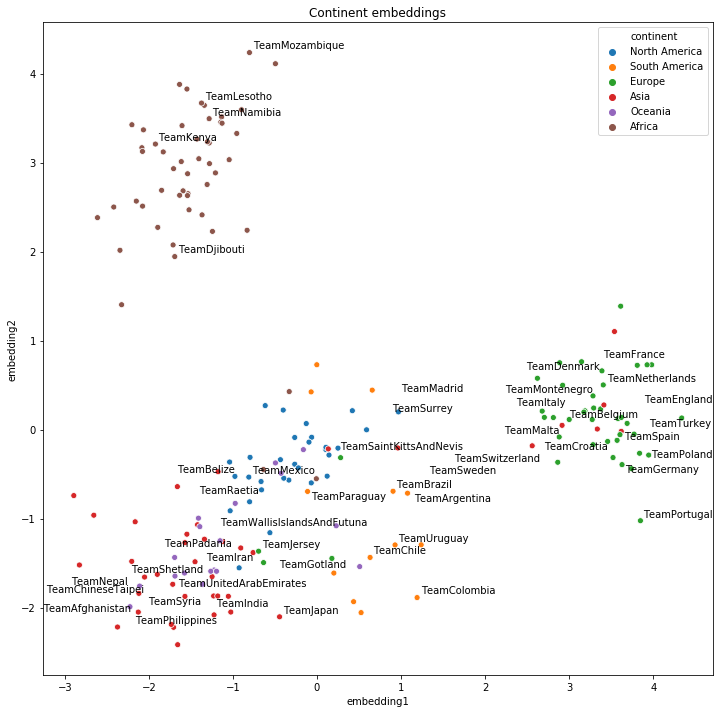
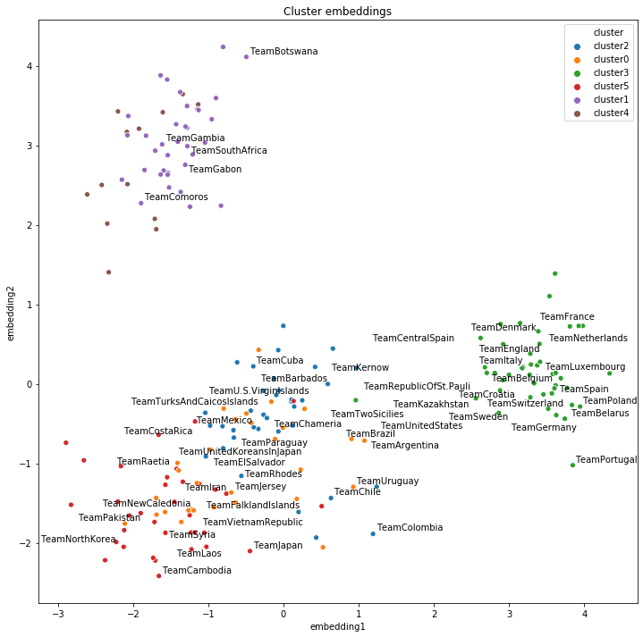

# Examples

These examples show how to get started with AmpliGraph APIs, and cover a range of useful tasks. 
Note that additional tutorials are also [available](tutorials.md).


## Train and evaluate an embedding model

```python
import numpy as np
from ampligraph.datasets import load_wn18
from ampligraph.latent_features import ScoringBasedEmbeddingModel
from ampligraph.evaluation import mrr_score, hits_at_n_score
from ampligraph.latent_features.loss_functions import get as get_loss
from ampligraph.latent_features.regularizers import get as get_regularizer
import tensorflow as tf

# load Wordnet18 dataset:
X = load_wn18()

# Initialize a ComplEx neural embedding model: the embedding size is k,
# eta specifies the number of corruptions to generate per each positive,
# scoring_type determines the scoring function of the embedding model.
model = ScoringBasedEmbeddingModel(k=150,
                                   eta=10,
                                   scoring_type='ComplEx')

# Optimizer, loss and regularizer definition
optim = tf.keras.optimizers.Adam(learning_rate=1e-3)
loss = get_loss('pairwise', {'margin': 0.5})
regularizer = get_regularizer('LP', {'p': 2, 'lambda': 1e-5})

# Compilation of the model
model.compile(optimizer=optim, loss=loss, entity_relation_regularizer=regularizer)

# For evaluation, we can use a filter which would be used to filter out
# positives statements created by the corruption procedure.
# Here we define the filter set by concatenating all the positives
filter = {'test' : np.concatenate((X['train'], X['valid'], X['test']))}

# Early Stopping callback
checkpoint = tf.keras.callbacks.EarlyStopping(
    monitor='val_{}'.format('hits10'),
    min_delta=0,
    patience=5,
    verbose=1,
    mode='max',
    restore_best_weights=True
)

# Fit the model on training and validation set
model.fit(X['train'],
          batch_size=int(X['train'].shape[0] / 10),
          epochs=20,                    # Number of training epochs
          validation_freq=20,           # Epochs between successive validation
          validation_burn_in=100,       # Epoch to start validation
          validation_data=X['valid'],   # Validation data
          validation_filter=filter,     # Filter positives from validation corruptions
          callbacks=[checkpoint],       # Early stopping callback (more from tf.keras.callbacks are supported)
          verbose=True                  # Enable stdout messages
          )


# Run the evaluation procedure on the test set (with filtering)
# To disable filtering: use_filter=None
# Usually, we corrupt subject and object sides separately and compute ranks
ranks = model.evaluate(X['test'],
                       use_filter=filter,
                       corrupt_side='s,o')

# compute and print metrics:
mrr = mrr_score(ranks)
hits_10 = hits_at_n_score(ranks, n=10)
print("MRR: %f, Hits@10: %f" % (mrr, hits_10))
# Output: MRR: 0.884418, Hits@10: 0.935500
```


## Model selection


```python
from ampligraph.datasets import load_wn18
from ampligraph.evaluation import select_best_model_ranking

# load Wordnet18 dataset:
X_dict = load_wn18()

model_class = 'ComplEx'

# Use the template given below for doing grid search. 
param_grid = {
                 "batches_count": [10],
                 "seed": 0,
                 "epochs": [300],
                 "k": [100, 50],
                 "eta": [5,10],
                 "loss": ["pairwise", "nll", "self_adversarial"],
                 # We take care of mapping the params to corresponding classes
                 "loss_params": {
                     #margin corresponding to both pairwise and adverserial loss
                     "margin": [0.5, 20], 
                     #alpha corresponding to adverserial loss
                     "alpha": [0.5]
                 },
                 "embedding_model_params": {
                     # generate corruption using all entities during training
                     "negative_corruption_entities":"all"
                 },
                 "regularizer": [None, "LP"],
                 "regularizer_params": {
                     "p": [2],
                     "lambda": [1e-4, 1e-5]
                 },
                 "optimizer": ["adam"],
                 "optimizer_params":{
                     "lr": [0.01, 0.0001]
                 },
                 "verbose": True
             }

# Train the model on all possibile combinations of hyperparameters.
# Models are validated on the validation set.
# It returnes a model re-trained on training and validation sets.
best_model, best_params, best_mrr_train, \
ranks_test, test_evaluation, experimental_history = \
                        select_best_model_ranking(model_class, # Name of the model to be used
                                                  # Dataset 
                                                  X_dict['train'],
                                                  X_dict['valid'],
                                                  X_dict['test'],          
                                                  # Parameter grid
                                                  param_grid,
                                                  # Set maximum number of combinations
                                                  max_combinations=20,
                                                  # Use filtered set for eval
                                                  use_filter=True, 
                                                  # corrupt subject and objects separately during eval
                                                  corrupt_side='s,o', 
                                                  # Log all the model hyperparams and evaluation stats
                                                  verbose=True)
print(type(best_model).__name__)
print("Best model parameters: ")
print(best_params)
print("Best MRR train: ", best_mrr_train)
print("Test evaluation: ", test_evaluation)
# Output:
# ComplEx

# Best model parameters:
# {'batches_count': 10, 'seed': 0, 'epochs': 300, 'k': 100, 'eta': 10,
# 'loss': 'self_adversarial', 'loss_params': {'margin': 0.5, 'alpha': 0.5},
# 'embedding_model_params': {'negative_corruption_entities': 'all'}, 'regularizer': 'LP',
# 'regularizer_params': {'p': 2, 'lambda': 0.0001}, 'optimizer': 'adam',
# 'optimizer_params': {'lr': 0.01}, 'verbose': True}

# Best MRR train: 0.9341455440346633 

# Test evaluation: {'mrr': 0.934852832005159, 'mr': 674.1877, 'hits_1': 0.9276, 'hits_3': 0.9406, 'hits_10': 0.9454}


```

## Get the embeddings

```python
import numpy as np
from ampligraph.latent_features import ScoringBasedEmbeddingModel

model = ScoringBasedEmbeddingModel(k=5, eta=1, scoring_type='TransE')
model.compile(optimizer='adam', loss='nll')
X = np.array([['a', 'y', 'b'],
              ['b', 'y', 'a'],
              ['a', 'y', 'c'],
              ['c', 'y', 'a'],
              ['a', 'y', 'd'],
              ['c', 'y', 'd'],
              ['b', 'y', 'c'],
              ['f', 'y', 'e']])
model.fit(X, epochs=5)
model.get_embeddings(['f','e'], embedding_type='e')
# Output
# [[ 0.5677353   0.65208733  0.66626084  0.7323714   0.43467668]
#  [-0.7102897   0.59935296  0.17629518  0.5096843  -0.53681636]]
```

## Save and Restore a Model
```python
import numpy as np
from ampligraph.latent_features import ScoringBasedEmbeddingModel
from ampligraph.utils import save_model, restore_model

model = ScoringBasedEmbeddingModel(k=5, eta=1, scoring_type='ComplEx')
model.compile(optimizer='adam', loss='nll')

X = np.array([['a', 'y', 'b'],
              ['b', 'y', 'a'],
              ['a', 'y', 'c'],
              ['c', 'y', 'a'],
              ['a', 'y', 'd'],
              ['c', 'y', 'd'],
              ['b', 'y', 'c'],
              ['f', 'y', 'e']])

model.fit(X, epochs=5)

#  Use the trained model to predict
y_pred_before = model.predict(np.array([['f', 'y', 'e'], ['b', 'y', 'd']]))
print(y_pred_before)
# [ 0.1416718 -0.0070735]

# Save the model
example_name = "helloworld.pkl"
save_model(model, model_name_path=example_name)

# Restore the model
restored_model = restore_model(model_name_path=example_name)

# Use the restored model to predict
y_pred_after = restored_model.predict(np.array([['f', 'y', 'e'], ['b', 'y', 'd']]))
print(y_pred_after)
# [ 0.1416718 -0.0070735]
```

## Split dataset into train/test or train/valid/test 
```python
import numpy as np
from ampligraph.evaluation import train_test_split_no_unseen
from ampligraph.datasets import load_from_csv

'''
Assume we have a knowledge graph stored in my_folder/my_graph.csv,
and that the content of such file is:

a,y,b
f,y,e
b,y,a
a,y,c
c,y,a
a,y,d
c,y,d
b,y,c
f,y,e
'''

# Load the graph in memory
X = load_from_csv('my_folder', 'my_graph.csv', sep=',')

# To split the graph in train and test sets:
# (In this toy example the test set will include only two triples)
X_train, X_test = train_test_split_no_unseen(X, test_size=2)

print(X_train)

'''
X_train:[['a' 'y' 'b']
         ['f' 'y' 'e']
         ['b' 'y' 'a']
         ['c' 'y' 'a']
         ['c' 'y' 'd']
         ['b' 'y' 'c']
         ['f' 'y' 'e']]
'''

print(X_test)

'''
X_test: [['a' 'y' 'c']
         ['a' 'y' 'd']]
'''


# To split the graph in train, validation, and test the method must be called twice:
X_train_valid, X_test = train_test_split_no_unseen(X, test_size=2)
X_train, X_valid = train_test_split_no_unseen(X_train_valid, test_size=2)

print(X_train)
'''
X_train:  [['a' 'y' 'b']
           ['b' 'y' 'a']
           ['c' 'y' 'd']
           ['b' 'y' 'c']
           ['f' 'y' 'e']]
'''

print(X_valid)
'''
X_valid:  [['f' 'y' 'e']
           ['c' 'y' 'a']]
'''

print(X_test)
'''
X_test:  [['a' 'y' 'c']
          ['a' 'y' 'd']]
'''

```

## Clustering and Visualizing Embeddings

### Model Training and Evaluation

```python
import numpy as np
import requests
import tensorflow as tf

from ampligraph.datasets import load_from_csv
from ampligraph.latent_features import ScoringBasedEmbeddingModel
from ampligraph.latent_features.loss_functions import get as get_loss
from ampligraph.latent_features.regularizers import get as get_regularizer
from ampligraph.evaluation import mr_score, mrr_score, hits_at_n_score
from ampligraph.evaluation import train_test_split_no_unseen

# International football matches triples
url = 'https://ampligraph.s3-eu-west-1.amazonaws.com/datasets/football.csv'
open('football.csv', 'wb').write(requests.get(url).content)
X = load_from_csv('.', 'football.csv', sep=',')[:, 1:]

# Train test split
X_train, X_test = train_test_split_no_unseen(X, test_size=10000)

# # # MODEL TRAINING # # #

# Initialize a ComplEx neural embedding model
model = ScoringBasedEmbeddingModel(k=100,
                                   eta=20,
                                   scoring_type='ComplEx')

# Optimizer, loss and regularizer definition
optim = tf.keras.optimizers.Adam(learning_rate=1e-4)
loss = get_loss('multiclass_nll')
regularizer = get_regularizer('LP', {'p': 3, 'lambda': 1e-5})

# Compilation of the model
model.compile(optimizer=optim, loss=loss, entity_relation_regularizer=regularizer)

# Fit the model
model.fit(X_train,
          batch_size=int(X_train.shape[0] / 50),
          epochs=300,  # Number of training epochs
          verbose=True  # Enable stdout messages
          )

# # # MODEL EVALUATION # # #
# Specify triples to filter out of corruptions since true positives
filter_triples = {'test': np.concatenate((X_train, X_test))}
# Evaluation of the model
ranks = model.evaluate(X_test,
                       use_filter=filter_triples,
                       verbose=True)

mr = mr_score(ranks)
mrr = mrr_score(ranks)

print("MRR: %.2f" % (mrr))
print("MR: %.2f" % (mr))

hits_10 = hits_at_n_score(ranks, n=10)
print("Hits@10: %.2f" % (hits_10))
hits_3 = hits_at_n_score(ranks, n=3)
print("Hits@3: %.2f" % (hits_3))
hits_1 = hits_at_n_score(ranks, n=1)
print("Hits@1: %.2f" % (hits_1))
# Output:
# MRR: 0.29
# MR: 3450.72
# Hits@10: 0.41
# Hits@3: 0.34
# Hits@1: 0.22
```


### Clustering and 2D Projections
Please install lib `adjustText` using the following command: `pip install adjustText`.
Further, please install `pycountry_convert` with the following command: `pip install pycountry_convert`.
This library is used to map countries to the corresponding continents.

```python
import pandas as pd
import re
from sklearn.decomposition import PCA
from sklearn.cluster import KMeans
import matplotlib.pyplot as plt
import seaborn as sns
from adjustText import adjust_text
import pycountry_convert as pc
from ampligraph.discovery import find_clusters

# Get the teams entities and their corresponding embeddings
triples_df = pd.DataFrame(X, columns=['s', 'p', 'o'])
teams = triples_df.s[triples_df.s.str.startswith('Team')].unique()
team_embeddings = dict(zip(teams, model.get_embeddings(teams)))
team_embeddings_array = np.array([i for i in team_embeddings.values()])

# Project embeddings into 2D space via PCA in order to plot them
embeddings_2d = PCA(n_components=2).fit_transform(team_embeddings_array)

# Cluster embeddings (on the original space)
clustering_algorithm = KMeans(n_clusters=6, n_init=100, max_iter=500, random_state=0)
clusters = find_clusters(teams, model, clustering_algorithm, mode='e')

# This function maps country to continent
def cn_to_ctn(team_name):
    try:
        country_name = ' '.join(re.findall('[A-Z][^A-Z]*', team_name[4:]))
        country_alpha2 = pc.country_name_to_country_alpha2(country_name)
        country_continent_code = pc.country_alpha2_to_continent_code(country_alpha2)
        country_continent_name = pc.convert_continent_code_to_continent_name(country_continent_code)
        return country_continent_name
    except KeyError:
        return "unk"


plot_df = pd.DataFrame({"teams": teams,
                        "embedding1": embeddings_2d[:, 0],
                        "embedding2": embeddings_2d[:, 1],
                        "continent": pd.Series(teams).apply(cn_to_ctn),
                        "cluster": "cluster" + pd.Series(clusters).astype(str)})

# Top 20 teams in 2019 according to FIFA rankings
top20teams = ["TeamBelgium", "TeamFrance", "TeamBrazil", "TeamEngland", "TeamPortugal",
              "TeamCroatia", "TeamSpain", "TeamUruguay", "TeamSwitzerland", "TeamDenmark",
              "TeamArgentina", "TeamGermany", "TeamColombia", "TeamItaly", "TeamNetherlands",
              "TeamChile", "TeamSweden", "TeamMexico", "TeamPoland", "TeamIran"]

np.random.seed(0)

# Plot 2D embeddings with country labels
def plot_clusters(hue):
    plt.figure(figsize=(12, 12))
    plt.title("{} embeddings".format(hue).capitalize())
    ax = sns.scatterplot(data=plot_df[plot_df.continent != "unk"],
                         x="embedding1", y="embedding2", hue=hue)
    texts = []
    for i, point in plot_df.iterrows():
        if point["teams"] in top20teams or np.random.random() < 0.1:
            texts.append(plt.text(point['embedding1'] + 0.02,
                                  point['embedding2'] + 0.01,
                                  str(point["teams"])))
    adjust_text(texts)

    plt.savefig(hue + '_cluster_ex.png')

plot_clusters("continent")
plot_clusters("cluster")
```

### Results Visualization

```python
plot_clusters("continent")
plot_clusters("cluster")
```



