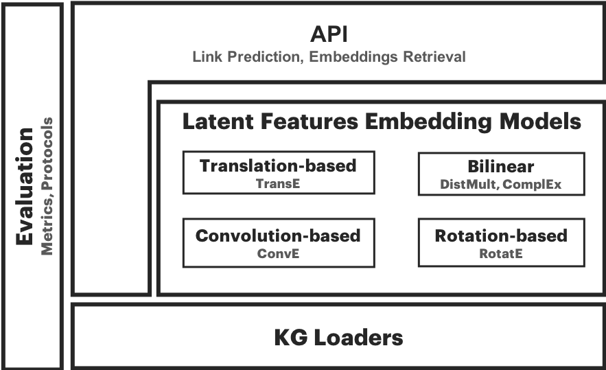
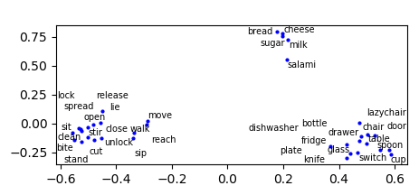

.. xai_lp documentation master file, created by
   sphinx-quickstart on Tue Oct 17 14:10:15 2017.
   You can adapt this file completely to your liking, but it should at least
   contain the root `toctree` directive.

AmpliGraph
==================

**Open source Python library that predicts links between concepts in a knowledge graph.**

AmpliGraph is a suite of neural machine learning models for relational Learning, a branch of machine learning
that deals with supervised learning on knowledge graphs.

.. image:: img/kg_lp.png

**Use AmpliGraph if you need to**:

* Discover new knowledge from an existing knowledge graph.
* Complete large knowledge graphs with missing statements.
* Generate stand-alone knowledge graph embeddings.
* Develop and evaluate a new relational model.

AmpliGraph's machine learning models generate **knowledge graph embeddings**, vector representations of concepts in a metric space:

.. image:: img/kg_lp_step1.png

It then combines embeddings with model-specific scoring functions to predict unseen and novel links:

.. image:: img/kg_lp_step2.png

Key Features
------------

* **Intuitive APIs**: AmpliGraph APIs are designed to reduce the code amount required to learn models that predict links in knowledge graphs.
* **GPU-Ready**: AmpliGraph is based on TensorFlow, and it is designed to run seamlessly on CPU and GPU devices - to speed-up training.
* **Extensible**: Roll your own knowledge graph embeddings model by extending AmpliGraph base estimators.

.. The library includes Relational Learning models, i.e. supervised learning models designed to predict
.. links in knowledge graphs.

.. The tool also includes the required evaluation protocol, metrics, knowledge graph preprocessing,
.. and negative statements generator strategies.

System Architecture
-------------------

AmpliGraph includes the following submodules:

* **KG Loaders**: Helper functions to load datasets (knowledge graphs).
* **Latent Feature Models**: knowledge graph embedding models. AmpliGraph contains: TransE, DistMult, ComplEx, ConvE, and RotatE.
* **Evaluation**: Metrics and evaluation protocols to assess the predictive power of the models.

Quick Start
-----------

Import a dataset with helper functions:

.. code:: ipython3

    X = load_wn18()

Declare a knowledge graph embeddings model:

.. code:: ipython3
    
    model = ComplEx()

Fit the model on the training set

.. code:: ipython3

    model.fit(X['train'])

Predict scores for 5 unseen statements, and convert scores into probability estimates:

.. code:: ipython3

    y_pred = model.predict(X['test'][:5,])

    from scipy.special import expit
    expit(y_pred)

    array([0.76576346, 0.7471501 , 0.7953226 , 0.76191056, 0.7733138 ],
      dtype=float32)

Evaluate the performance of the model with the state-of-the-art evaluation protocol:

.. code:: ipython3

 ranks = evaluate_performance(X['test'][:10], model=model)
 print(ranks)

 [ 1  2  1  1  2  1  1  1  1 17]

Compute learning to rank metrics:

.. code:: ipython3

    mrr = mrr_score(ranks)
    hits_10 = hits_at_n_score(ranks, n=10)
    print("MRR: %f, Hits@10: %f" % (mrr, hits_10))
   

    MRR: 0.805882, Hits@10: 0.900000

Apply dimensionality reduction and visualize the embeddings:

.. code:: ipython3

   import matplotlib.pyplot as plt
   from sklearn.manifold import TSNE
   
   embs = model.get_embeddings(embs_labels, type='entity')
   embs_2d = TSNE(n_components=2).fit_transform(embs)

   fig, ax = plt.subplots()
   ax.scatter(embs_2d[:, 0], embs_2d[:, 1])
   for i, lab in enumerate(embs_labels):
       ax.annotate(lab, (embs_2d[i, 0], embs_2d[i, 1]))

   plt.show(fig)

.. toctree::
   :maxdepth: 1
   :caption: Contents:

   install
   api
   dev
   examples
   biblio
   changelog
   contacts

