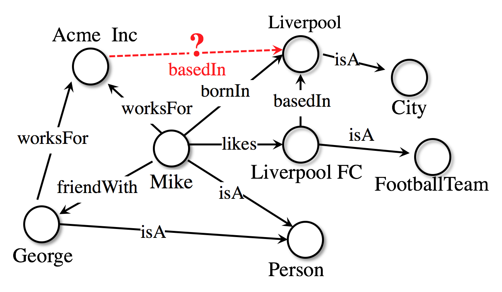

AmpliGraph
==========

**Open source Python library that predicts links between concepts in a knowledge graph.**

`Go to the GitHub repository <https://github.com/Accenture/AmpliGraph/>`_ |ImageLink|_

   .. |ImageLink| image:: /img/GitHub-Mark-32px.png
   .. _ImageLink: https://github.com/Accenture/AmpliGraph/

`Join the conversation on Slack <https://join.slack.com/t/ampligraph/shared_invite/enQtNTc2NTI0MzUxMTM5LTRkODk0MjI2OWRlZjdjYmExY2Q3M2M3NGY0MGYyMmI4NWYyMWVhYTRjZDhkZjA1YTEyMzBkMGE4N2RmNTRiZDg>`_ |ImageLink2|_

   .. |ImageLink2| image:: /img/slack_logo.png
   .. _ImageLink2: https://join.slack.com/t/ampligraph/shared_invite/enQtNTc2NTI0MzUxMTM5LTRkODk0MjI2OWRlZjdjYmExY2Q3M2M3NGY0MGYyMmI4NWYyMWVhYTRjZDhkZjA1YTEyMzBkMGE4N2RmNTRiZDg>

.. note::
    **AmpliGraph 2.0.0 is now available!**

    The new version features TensorFlow 2 back-end and Keras style APIs that makes it faster, easier to use and
    extend the support for multiple features. Further, the data input/output pipeline has changed, and the support for
    some obsolete models was discontinued. See the Changelog for a more thorough list of changes.

AmpliGraph is a suite of neural machine learning models for relational Learning, a branch of machine learning
that deals with supervised learning on knowledge graphs.

**Use AmpliGraph if you need to**:

* Discover new knowledge from an existing knowledge graph.
* Complete large knowledge graphs with missing statements.
* Generate stand-alone knowledge graph embeddings.
* Develop and evaluate a new relational model.

AmpliGraph's machine learning models generate **knowledge graph embeddings**, vector representations of concepts in a metric space:

.. image:: img/kg_lp_step1.png

It then combines embeddings with model-specific scoring functions to predict unseen and novel links:

.. image:: img/kg_lp_step2.png

Key Features
------------

* **Intuitive APIs**: AmpliGraph APIs are designed to reduce the code amount required to learn models that predict links in knowledge graphs. The new version AmpliGraph 2 APIs are in Keras style, making the user experience even smoother.
* **GPU-Ready**: AmpliGraph 2 is based on TensorFlow 2, and it is designed to run seamlessly on CPU and GPU devices - to speed-up training.
* **Extensible**: Roll your own knowledge graph embeddings model by extending AmpliGraph base estimators.

.. The library includes Relational Learning models, i.e. supervised learning models designed to predict
.. links in knowledge graphs.

.. The tool also includes the required evaluation protocol, metrics, knowledge graph preprocessing,
.. and negative statements generator strategies.

Modules
-------

AmpliGraph includes the following submodules:

* **Datasets**: helper functions to load datasets (knowledge graphs).
* **Models**: knowledge graph embedding models. AmpliGraph 2 contains **TransE**, **DistMult**, **ComplEx**, **HolE** (More to come!)
* **Evaluation**: metrics and evaluation protocols to assess the predictive power of the models.
* **Discovery**: High-level convenience APIs for knowledge discovery (discover new facts, cluster entities, predict near duplicates).
* **Compat**: submodule that extends the compatibility of AmpliGraph 2 APIs to those of AmpliGraph 1.x for the user already familiar with them.

How to Cite
-----------

If you like AmpliGraph and you use it in your project, why not starring the `project on GitHub <https://github.com/Accenture/AmpliGraph/>`_!

|GitHub stars|

.. |GitHub stars| image:: https://img.shields.io/github/stars/Accenture/AmpliGraph.svg?style=social&label=Star&maxAge=3600
   :target: https://github.com/Accenture/AmpliGraph/stargazers/

If you instead use AmpliGraph in an academic publication, cite as:

.. code-block:: bibtex

   @misc{ampligraph,
     author= {Luca Costabello and
              Sumit Pai and
              Chan Le Van and
              Rory McGrath and
              Nick McCarthy and
              Pedro Tabacof},
     title = {{AmpliGraph: a Library for Representation Learning on Knowledge Graphs}},
     month = mar,
     year  = 2019,
     doi   = {10.5281/zenodo.2595043},
     url   = {https://doi.org/10.5281/zenodo.2595043}
   }

.. image:: https://zenodo.org/badge/DOI/10.5281/zenodo.2595043.svg
   :target: https://doi.org/10.5281/zenodo.2595043

.. toctree::
   :maxdepth: 1
   :caption: Contents:

   install
   background
   api
   dev
   examples
   tutorials
   experiments
   biblio
   changelog
   contacts

